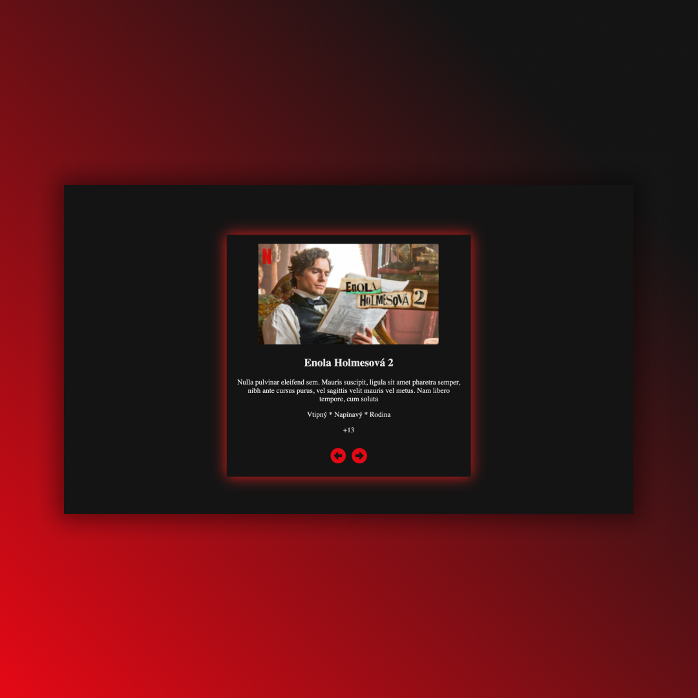

## Slider
• Practicing useState, useEffect, map, destructuring ✅

## Screenshots 📱

## 💻 Tech Stack

## 🌐 Link
<a href="https://slider-dejvcodes.netlify.app/">Slider</a>

## License🔐
[MIT License](LICENSE)